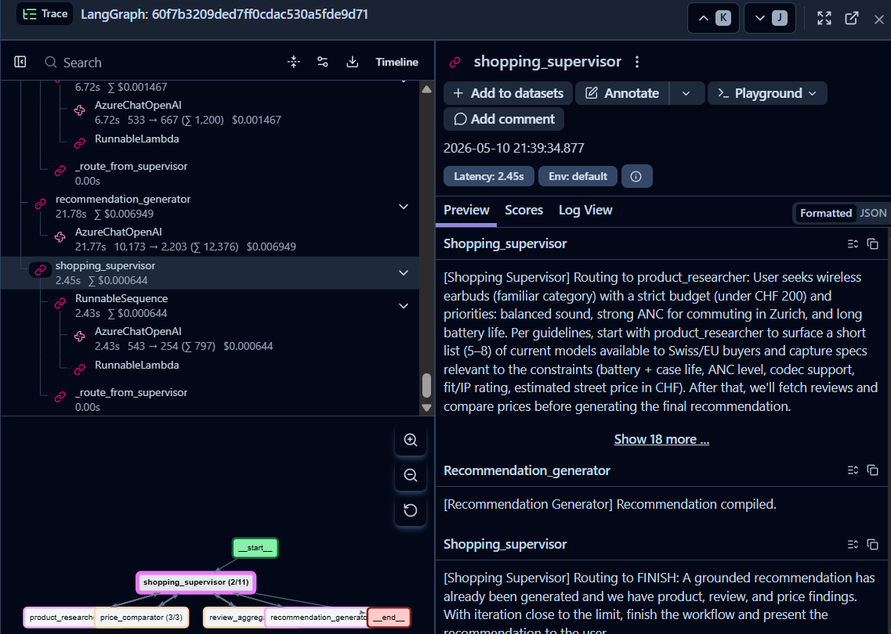
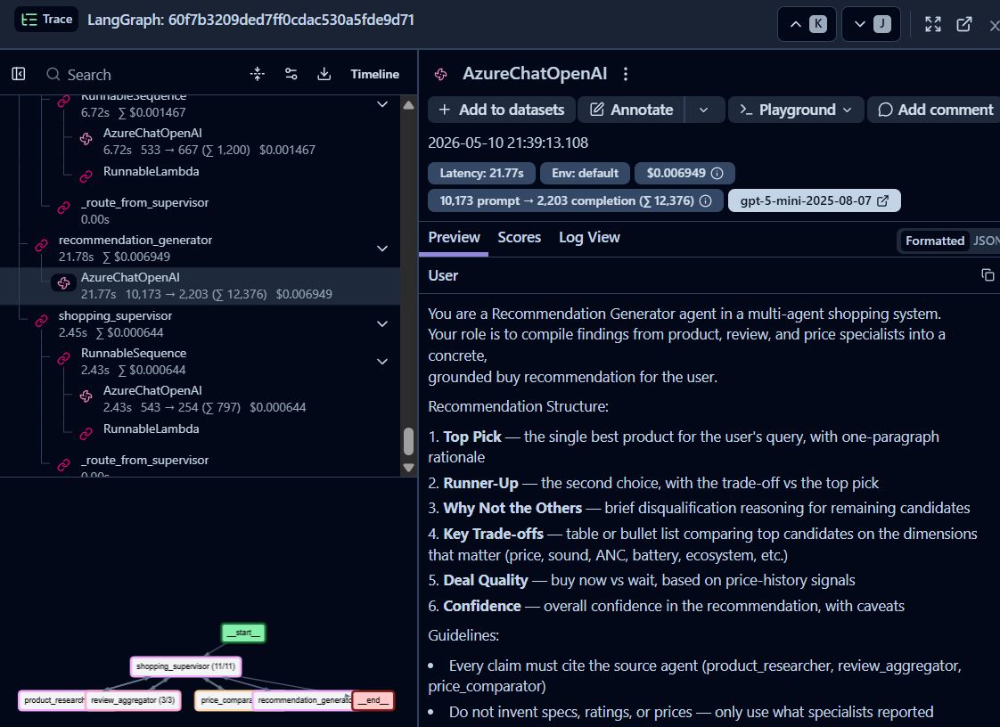

# LangGraph Multi-Agent Investigation System on Azure

> Supervisor-routed multi-agent system for grounded, citation-backed knowledge synthesis across heterogeneous sources. Built with **LangGraph + FastAPI + Azure OpenAI**, with **automated LLM-as-judge evaluation** and **end-to-end Langfuse observability**. Demonstrated on two domains — financial investigation and consumer product discovery — using the same architecture.

---

## Why this exists

Most "agentic" systems demoed online stop at "look, the agent talks to itself." Production agentic systems need three things the demos skip:

1. **Routing that is observable and bounded** — a supervisor that decides which specialist to call, with iteration limits and recovery paths.
2. **Outputs that can be evaluated** — automated scoring for hallucination, citation, and coherence, not just "did the LLM run."
3. **Per-agent traces in production** — when a call takes 8 seconds in the field, you need to know which agent and which tool call burned the budget.

This project ships all three, on Azure, with a Langfuse trace for every run.

---

## Architecture

```
                      ┌──────────────┐
                      │   USER       │
                      │   QUERY      │
                      └──────┬───────┘
                             ▼
                      ┌──────────────┐
                      │  SUPERVISOR  │◄──────────────────────┐
                      │  (routing)   │                       │
                      └──────┬───────┘                       │
                             ▼                               │
                ┌────────┬───┴───┬────────┬─────────────┐    │
                ▼        ▼       ▼        ▼             ▼    │
           ┌────────┐ ┌─────┐ ┌─────┐ ┌─────────┐ ┌────────┐ │
           │  DOC   │ │ FIN │ │ WEB │ │ REPORT  │ │ FINISH │ │
           │analyst │ │anlst│ │rsrch│ │generator│ │        │ │
           └───┬────┘ └──┬──┘ └──┬──┘ └────┬────┘ └────────┘ │
               │         │      │         │                  │
               └─────────┴──────┴─────────┴──────────────────┘
                                          │
                                          ▼
                              ┌────────────────────────┐
                              │  EVALUATOR             │
                              │  hallucination,        │
                              │  citation, coherence   │
                              └───────────┬────────────┘
                                          ▼
                              ┌────────────────────────┐
                              │  LANGFUSE              │
                              │  routing decisions,    │
                              │  per-agent latency,    │
                              │  tool call traces      │
                              └────────────────────────┘
```

**Specialist agents (investigation):**
- `document_analyst` — hybrid (vector + text) RAG over indexed documents via Azure AI Search
- `financial_analyst` — quantitative analysis (anomaly detection, risk metrics)
- `web_researcher` — open-source intelligence gathering
- `report_generator` — final synthesized report with severity ratings and citations

**Supervisor** — uses structured output (Pydantic) to decide the next agent or terminate. Uses iteration counter as a safety bound.

**Evaluator** — LLM-as-judge plus rule-based completeness check. Gates: hallucination ≥ 0.5 and overall ≥ 0.6.

---

## Demo 1 — Investigation pipeline

**Query:** *"Investigate Tesla's financial risks following Q3 2024 earnings — automotive margins, FCF quality, NHTSA/FSD regulatory exposure, Cybertruck execution."*

**Result:** [`examples/sample_investigation.md`](examples/sample_investigation.md)

| Metric | Score |
|---|---|
| Overall | **0.96** |
| Hallucination (LLM-as-judge, 1.0 = no hallucinations) | 0.93 |
| Citation (claims attributed to source agents) | 0.97 |
| Completeness (required report sections) | 1.00 |
| Coherence | 0.98 |
| **Passed gate** | ✓ |

**Agent sequence (real run):** 24 supervisor-routed invocations across all four specialists before terminating with `report_generator → FINISH`.

```
supervisor → web_researcher → supervisor → financial_analyst →
supervisor → document_analyst → supervisor → financial_analyst →
... → supervisor → report_generator → supervisor → FINISH
```

**Reproduce locally:**
```bash
.venv/bin/python -m scripts.run_investigation_demo
```

**Langfuse trace from the actual run** — supervisor routing reasoning visible on the right; LangGraph topology (`supervisor → web_researcher | financial_analyst | document_analyst | report_generator → end`) at the bottom:


---

## Demo 2 — Product discovery

I added a second graph to make the architecture's transferability concrete instead of theoretical: same supervisor pattern, state shape, evaluator, LLM factory, and Langfuse callback — only the four specialist agents and their tools are swapped. The point isn't that the project does both, it's that the pattern is the deliverable, not the domain.

**Query:** *"Wireless earbuds under CHF 200 — best balance of sound, ANC, and battery for daily commuting in Zurich. Recommend the top pick."*

**Result:** [`examples/sample_shopping.md`](examples/sample_shopping.md)

**Specialist agents (shopping):**
- `product_researcher` — surfaces candidates with specs from product catalogs
- `review_aggregator` — synthesizes professional + user reviews across sources
- `price_comparator` — current + 30-day historical pricing across retailers
- `recommendation_generator` — final grounded "buy this" recommendation

**Reproduce locally:**
```bash
.venv/bin/python -m scripts.run_shopping_demo
```

**Langfuse trace from the actual shopping run** — different graph topology, same orchestration pattern:



### Architecture mapping — investigation → product discovery

| Investigation pipeline | Product discovery pipeline | Shared component |
|---|---|---|
| `supervisor` (routing) | `shopping_supervisor` (routing) | Same Pydantic-structured-output pattern |
| `document_analyst` (RAG over filings) | `product_researcher` (catalog search) | Same agentic loop, different tool |
| `financial_analyst` (numbers) | `price_comparator` (deal quality) | Same agentic loop, different tool |
| `web_researcher` (news/web) | `review_aggregator` (reviews) | Same agentic loop, different tool |
| `report_generator` (investigation report) | `recommendation_generator` (buy recommendation) | Same synthesis pattern, citation-grounded |
| `evaluator` (hallucination/citation) | *same evaluator* | **Reused 1:1** — wrong specs in a recommendation = lost user trust, identical guardrail |
| Langfuse callback | *same callback* | **Reused 1:1** — per-agent latency + routing trace |
| `GraphState` | `ShoppingState` | Same TypedDict + Annotated reducer pattern |

**What this demonstrates:** the architecture is the product, not the domain.

---

## Tech stack

| Layer | Tool |
|---|---|
| Agent orchestration | LangGraph (StateGraph + conditional edges) |
| LLM | Azure OpenAI (gpt-5-mini in this demo; gpt-4o equivalent supported) |
| Embeddings | Azure OpenAI `text-embedding-3-large` |
| Vector + text retrieval | Azure AI Search (HNSW, hybrid) |
| State persistence (production) | Azure Cosmos DB |
| Document storage (production) | Azure Blob Storage |
| API | FastAPI |
| Evaluation | LLM-as-judge (Azure OpenAI) + rule-based completeness |
| **Observability** | **Langfuse** — agent traces, routing decisions, per-agent latency |
| Tooling | Pydantic, async, ruff, mypy strict, pytest |
| Build | Hatchling |

---

## Quickstart

```bash
# 1. Clone + install
git clone https://github.com/PanagiotisPatsias/LangGraph-Multi-Agent-Investigation-System-on-Azure
cd LangGraph-Multi-Agent-Investigation-System-on-Azure
uv venv --python 3.12 && uv pip install -e .

# 2. Configure (minimum: AZURE_OPENAI_* + LANGFUSE_*)
cp .env.example .env
# edit .env with your keys

# 3. Smoke-test the integration
.venv/bin/python -m scripts.test_langfuse

# 4. Run a demo (uses fixture data via MOCK_TOOLS=true)
.venv/bin/python -m scripts.run_investigation_demo
.venv/bin/python -m scripts.run_shopping_demo
```

Open https://cloud.langfuse.com → see the trace tree (supervisor decisions, per-agent spans, tool calls, latency).

---

## Project structure

```
src/
├── agents/
│   ├── supervisor.py                  # investigation supervisor (Pydantic-structured routing)
│   ├── document_analyst.py
│   ├── financial_analyst.py
│   ├── web_researcher.py
│   ├── report_generator.py
│   └── shopping/                      # parallel agent set, same pattern
│       ├── supervisor.py
│       ├── product_researcher.py
│       ├── review_aggregator.py
│       ├── price_comparator.py
│       └── recommendation_generator.py
├── graph/
│   ├── investigation_graph.py
│   ├── state.py
│   ├── shopping_graph.py
│   └── shopping_state.py
├── tools/
│   ├── azure_search.py                # hybrid HNSW retrieval (live or mocked)
│   ├── web_search.py                  # web/news retrieval (live or mocked)
│   ├── financial_data.py              # pure-compute, no external deps
│   ├── product_search.py              # shopping tools (live or mocked)
│   └── _mock_data.py                  # fixtures for demo runs
├── evaluation/
│   └── evaluator.py                   # LLM-as-judge + rule-based scoring
├── services/                          # Cosmos / Blob / document handling (FastAPI layer)
├── api/                               # FastAPI routes
└── config/
    ├── settings.py                    # pydantic-settings, includes Langfuse callback factory
    └── llm_factory.py                 # AzureChatOpenAI factory (handles gpt-5/o-series quirks)

scripts/
├── test_langfuse.py
├── run_investigation_demo.py
└── run_shopping_demo.py

examples/
├── sample_investigation.md            # real generated report from a demo run
└── sample_shopping.md                 # real generated recommendation from a demo run
```

---

## What's mocked vs production

With `MOCK_TOOLS=true`, the only thing that changes is the data returned by the search tools. Everything else — Azure OpenAI calls, supervisor routing, agent loops, evaluator scoring, Langfuse traces — runs for real.

The mock pattern lives in [`src/tools/_mock_data.py`](src/tools/_mock_data.py): when an agent calls `search_documents` / `web_search` / `search_products`, it gets curated fixtures instead of hitting Azure AI Search / Bing / an e-commerce API. Same string format, same downstream behavior.

**Why mock for a portfolio demo:** the project demonstrates the agent orchestration layer — supervisor routing, evaluator gating, per-agent observability. Fixtures keep the demo reproducible: anyone cloning the repo can run the same trace without provisioning Azure resources or paying for indexed corpora. The data layer is fully wired (live code paths exist in [`azure_search.py`](src/tools/azure_search.py) and a Tavily/Serper swap is the only change needed in [`web_search.py`](src/tools/web_search.py) since Bing v7 was retired Aug 2025) — it just runs against fixtures by default.

**To go production:** unset `MOCK_TOOLS`, populate the relevant `.env` keys, and ingest a real corpus via `AzureSearchManager.index_chunks()`. No agent, supervisor, evaluator, or graph changes required.

---

## Per-LLM-call observability

Every LLM invocation inside an agent is captured as a span with prompts, completions, token counts, and cost. Below: the recommendation_generator's `AzureChatOpenAI` call — `gpt-5-mini-2025-08-07`, 10,173 prompt + 2,203 completion tokens, $0.0069, with the structured system prompt visible:



This is what makes "agent took 8 seconds in production" debuggable instead of mysterious.

---

## Notable engineering decisions

- **Reasoning-model quirks handled in `llm_factory.py`** — gpt-5 and o-series only allow default temperature and reserve part of the token budget for internal reasoning. The factory detects these and skips the unsupported parameters rather than failing.
- **Supervisor uses Pydantic structured output**, not free-text parsing — eliminates an entire category of routing bugs.
- **Iteration count as a safety bound** — every graph run has a hard ceiling that forces `report_generator` if exceeded. Real Langfuse trace from the demo shows the supervisor making 12 routing decisions before terminating cleanly.
- **State uses `Annotated` reducers** — `findings` lists merge with `operator.add`, `messages` use `add_messages` — so partial updates from any agent compose correctly.
- **Evaluator gates on overall score AND minimum hallucination** — both must pass. Single-metric gates create gaming incentives.

---

## Reproducibility

The reported scores in this README come from an actual run (`MOCK_TOOLS=true`, gpt-5-mini, Azure OpenAI Switzerland North). Reproducing locally with the same fixtures should yield comparable but not bit-identical results — gpt-5-mini reasoning is deterministic-ish but token-level outputs vary across runs.

---

## License

MIT — see `LICENSE`.
