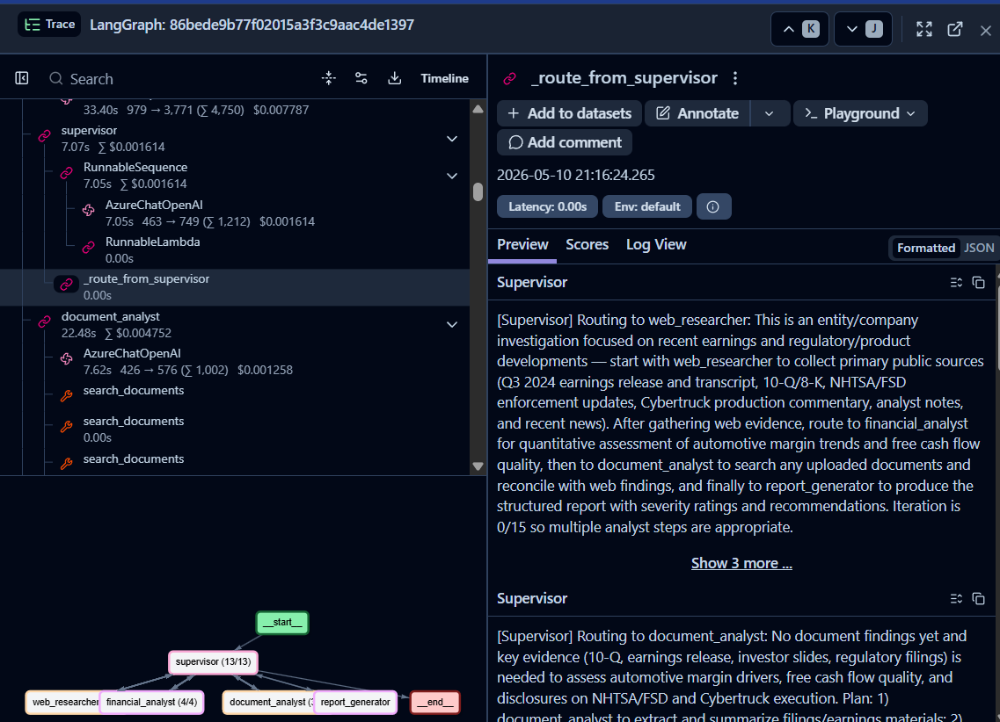

# LangGraph Multi-Agent Investigation System on Azure

> Supervisor-routed multi-agent system for grounded, citation-backed knowledge synthesis. Built with **LangGraph + FastAPI + Azure OpenAI**, with **end-to-end Langfuse observability** and a separate LLM-as-judge evaluator for post-run quality scoring.

---

## Architecture

```
                      ┌──────────────┐
                      │   USER QUERY │
                      └──────┬───────┘
                             ▼
   ┌─────────────────────────────────────────────────────┐
   │  LangGraph pipeline    (live-traced to Langfuse)    │
   │                                                     │
   │       ┌──────────────┐                              │
   │       │  SUPERVISOR  │◄──────────────────────┐      │
   │       │  (routing)   │                       │      │
   │       └──────┬───────┘                       │      │
   │              ▼                               │      │
   │  ┌────────┬──┴────┬────────┬───────────┐    │      │
   │  ▼        ▼       ▼        ▼           ▼    │      │
   │ ┌────┐ ┌─────┐ ┌─────┐ ┌─────────┐ ┌──────┐ │      │
   │ │DOC │ │ FIN │ │ WEB │ │ REPORT  │ │FINISH│ │      │
   │ │anl │ │anlst│ │rsrch│ │generator│ │      │ │      │
   │ └─┬──┘ └──┬──┘ └──┬──┘ └────┬────┘ └──────┘ │      │
   │   └──────┴───────┴─────────┴────────────────┘      │
   └────────────────────────┬────────────────────────────┘
                            │ final_state
                            ▼
              ┌─────────────────────────────────┐
              │  EVALUATOR  (post-run, optional)│
              │  hallucination, citation,       │
              │  coherence — invoked by the     │
              │  demo runner, not by the graph  │
              └─────────────────────────────────┘
```

**Specialist agents:**
- `document_analyst` — hybrid (vector + text) RAG over indexed documents via Azure AI Search
- `financial_analyst` — quantitative analysis (anomaly detection, risk metrics)
- `web_researcher` — open-source intelligence gathering
- `report_generator` — final synthesized report with severity ratings and citations

**Supervisor** — uses structured output (Pydantic) to decide the next agent or terminate. Uses iteration counter as a safety bound.

**Evaluator** — LLM-as-judge plus rule-based completeness check, run as a post-processing step on the final report. It is **not wired into the graph** as a node and does not gate the response — the demo runner ([`scripts/run_investigation_demo.py`](scripts/run_investigation_demo.py)) calls it after `run_investigation()` returns and prints the scores.

---

## Demo run

**Query:** *"Investigate Tesla's financial risks following Q3 2024 earnings — automotive margins, FCF quality, NHTSA/FSD regulatory exposure, Cybertruck execution."*

| Metric | Score |
|---|---|
| Overall | **0.96** |
| Hallucination (LLM-as-judge, 1.0 = no hallucinations) | 0.93 |
| Citation (claims attributed to source agents) | 0.97 |
| Completeness (required report sections) | 1.00 |
| Coherence | 0.98 |
| **Passed gate** | ✓ |

**Agent sequence:** 24 supervisor-routed invocations across all four specialists before terminating with `report_generator → FINISH`.

```
supervisor → web_researcher → supervisor → financial_analyst →
supervisor → document_analyst → supervisor → financial_analyst →
... → supervisor → report_generator → supervisor → FINISH
```

**Reproduce locally:**
```bash
.venv/bin/python -m scripts.run_investigation_demo
```

**Langfuse trace** — supervisor routing reasoning visible on the right; LangGraph topology at the bottom:



---

## Quickstart

```bash
# 1. Clone + install
git clone https://github.com/PanagiotisPatsias/LangGraph-Multi-Agent-Investigation-System-on-Azure
cd LangGraph-Multi-Agent-Investigation-System-on-Azure
uv venv --python 3.12 && uv pip install -e .

# 2. Configure (minimum: AZURE_OPENAI_* + LANGFUSE_*)
cp .env.example .env
# edit .env with your keys

# 3. Smoke-test the integration
.venv/bin/python -m scripts.test_langfuse

# 4. Run the demo (uses fixture data via MOCK_TOOLS=true)
.venv/bin/python -m scripts.run_investigation_demo
```

Open https://cloud.langfuse.com → see the trace tree (supervisor decisions, per-agent spans, tool calls, latency).

---

## Project structure

```
src/
├── agents/
│   ├── supervisor.py                  # Pydantic-structured routing
│   ├── document_analyst.py
│   ├── financial_analyst.py
│   ├── web_researcher.py
│   └── report_generator.py
├── graph/
│   ├── investigation_graph.py
│   └── state.py
├── tools/
│   ├── azure_search.py                # hybrid HNSW retrieval (live or mocked)
│   ├── web_search.py                  # web/news retrieval (live or mocked)
│   ├── financial_data.py              # pure-compute, no external deps
│   └── _mock_data.py                  # fixtures for demo runs
├── evaluation/
│   └── evaluator.py                   # LLM-as-judge + rule-based scoring
├── services/                          # Cosmos / Blob / document handling
├── api/                               # FastAPI routes
└── config/
    ├── settings.py                    # pydantic-settings + Langfuse callback factory
    └── llm_factory.py                 # AzureChatOpenAI factory

scripts/
├── test_langfuse.py
└── run_investigation_demo.py
```

---

## Mocked vs production

With `MOCK_TOOLS=true`, the only thing that changes is the data returned by the search tools. Azure OpenAI calls, supervisor routing, agent loops, evaluator scoring, and Langfuse traces all run for real.

The mock pattern lives in [`src/tools/_mock_data.py`](src/tools/_mock_data.py): when an agent calls `search_documents` / `web_search`, it gets curated fixtures instead of hitting Azure AI Search or a web search API. Same string format, same downstream behavior.

**To go production:** unset `MOCK_TOOLS`, populate the relevant `.env` keys, and ingest a real corpus via `AzureSearchManager.index_chunks()`. No agent, supervisor, evaluator, or graph changes required.

---

## Notable engineering decisions

- **Supervisor uses Pydantic structured output**, not free-text parsing — eliminates an entire category of routing bugs.
- **State uses `Annotated` reducers** — `findings` lists merge with `operator.add`, `messages` use `add_messages` — so partial updates from any agent compose correctly.
- **Reasoning-model quirks handled in `llm_factory.py`** — gpt-5 and o-series only allow default temperature and reserve part of the token budget for internal reasoning. The factory detects these and skips the unsupported parameters.

---

## License

MIT — see `LICENSE`.
